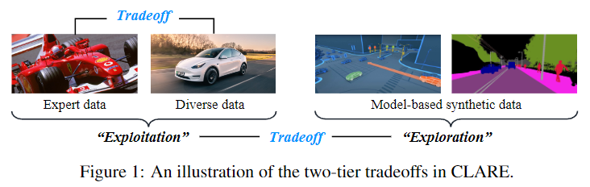
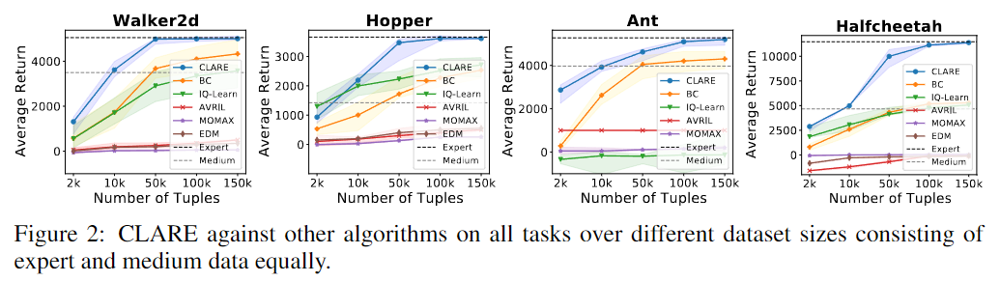
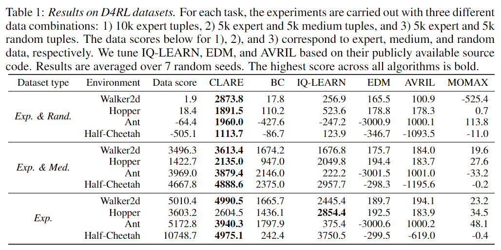
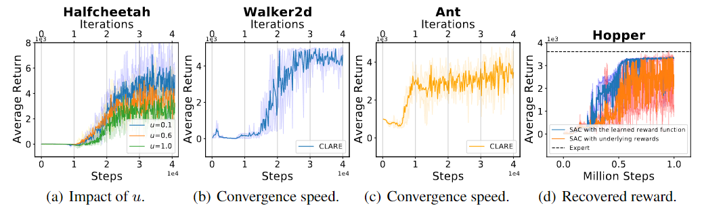

```{python}
a = 10
b = 20
print(a + b)
```

`{python} a` is ten.

:::{.callout-note}
내용
:::

::: {.panel-tabset}
## Python
```python
import numpy as np
```

## Julia
```julia
using LinearAlgebra
```
:::

## Abstract 초록
본 연구는 오프라인 역강화 학습(IRL)의 주요 난제인 _reward extrapolation error_(보상 외삽 오류)를 해결하고자 한다.

이는 학습된 보상 함수가 과업을 올바르게 설명하지 못하고, 내재된 공변량 변화(covariate shift)로 인해 접하지 못한 환경에서 에이전트를 잘못된 길로 이끌 수 있는 문제이다.

전문가 데이터와 품질이 낮은 다양한 데이터를 모두 활용하여, 본 연구에서는 학습된 보상 함수에 "보수성"을 추가하고 추정된 동역학 모델을 이용하여 오프라인 IRL을 효율적으로 해결하는 원칙에 기반하는 알고리즘(CLARE)을 고안했다.

우리의 이론적 분석은 학습된 정책과 전문가 정책 간의 수익 격차에 대한 상한선을 제공하여, 이를 바탕으로 (전문가 데이터와 다양한 데이터 모두에 대한) "활용"과 (추정된 동역학 모델에 대한) "탐색" 사이의 미묘한 이중적 트레이드 오프를 검토함으로써 공변량 변화의 영향을 규명한다.

우리는 CLARE가 적절한 '활용-탐색' 균형을 맞춤으로써 보상 외삽 오류를 이론적으로 완화할 수 있음을 보여준다.

광범위한 실험을 통해 MuJoCo 연속 제어 과업(특히 작은 오프라인 데이터셋의 경우)에서 CLARE가 기존의 최첨단 알고리즘들에 비해 상당한 성능 향상을 보임을 입증했으며, 학습된 보상은 추가적인 학습에 매우 유용하다는 것을 확인했다.

### 핵심 의문점
1. 오프라인 역강화 학습이란?
2. 보상 외삽 오류란?
3. 공변량 변화란?
4. "보수성(conservatism)"의 역할
5. 추정된 동역할 모델이란?
6. 활용-탐색 균형

## Introduction 소개
IRL의 주요 목표는 시연으로부터 보상 함수를 학습하는 것이다.
일반적으로, 기존의 IRL 방법은 (비용이 많이 들거나 완전히 알려진 전이 모델을 요구하는) 광범위한 온라인 시행착오에 의존하며, 많은 실제 응용 분야에서 확장하는 데 어려움을 겪는다.
이 문제를 해결하기 위해, 본 논문은 온라인 상호작용 없이 이전에 수집된 데이터셋으로부터 학습하는 데 초점을 맞춘 오프라인 IRL을 연구한다.
오프라인 IRL은 수동으로 적절한 보상을 식별하기는 어렵지만 인간 시연의 과거 데이터셋을 쉽게 사용할 수 있는 안전에 민감한 응용 분야(예: 헬스케어, 자율 주행, 로보틱스 등)에서 엄청난 잠재력을 가진다.
특히, 학습된 보상 함수는 전문가의 의도를 간결하게 표현하기 때문에 정책 학습(예: 오프라인 모방 학습(IL))뿐만 아니라 더 넓은 범위의 응용 분야(예: 과업 설명 및 전이 학습)에도 유용하다.
본 연구는 오프라인 IRL의 주요 난제, 즉 보상 외삽 오류를 해결하는 것을 목표로 하며, 이는 학습된 보상 함수가 과업을 올바르게 설명하지 못하고 보지 못한 환경에서 에이전트를 잘못 이끌 수 있는 문제이다.
이 문제는 제한된 전문가 시연(expert demonstrations)에서 상태의 부분적인 커버리지(즉, 공변량 변화)와 보상에 대한 고차원적이고 표현력이 풍부한 함수 근사로 인해 발생한다.
이는 감독을 위한 강화 신호가 없고 내재된 보상의 모호성 때문에 더욱 악화된다.
사실, 가치 함수에서의 외삽 오류와 관련된 유사한 문제들은 오프라인 (순방향) RL에서 널리 관찰되어 왔다.
불행히도, 우리가 아는 한, 최근 일부 진전에도 불구하고 이 문제는 오프라인 IRL에서 아직 잘 이해되지 않고 있다.
따라서 본 논문이 답하고자 하는 핵심 질문은 "보상 외삽 오류를 효과적으로 개선할 수 있는 오프라인 IRL 알고리즘을 어떻게 고안할 것인가?"이다.

우리는 이 질문에 대해, 공변량 변화에 대응하기 위해 상태-행동 공간의 커버리지를 강화하고자 (제한된) 고품질 전문가 데이터뿐만 아니라 (풍부할 수 있는) 저품질의 다양한 데이터를 활용하는, 원칙에 기반한 IRL 알고리즘인 CLARE(conservative model-based reward learning)를 소개한다.
CLARE는 분포를 벗어난 상태(out-of-distribution)에서의 잘못된 유도를 완화하기 위해 학습된 보상에 보수성을 적절히 통합하고, 학습된 동역학 모델을 활용하여 보상 일반화 능력을 향상시킴으로써 위에서 언급한 문제를 해결한다.
더 구체적으로, CLARE는 보수적인 보상 업데이트와 안전한 정책 개선을 반복하며, 보상 함수는 가중치가 부여된 전문가 및 다양한 상태-행동에 대한 가치를 높이는 동시에 모델 롤아웃(model rollouts)으로부터 생성된 것들에는 신중하게 페널티를 부여하는 방식으로 업데이트된다.
그 결과, 이 방법은 전문가의 의도를 담아내면서도 분포를 벗어난 상태-행동을 보수적으로 평가할 수 있으며, 이는 결과적으로 정책이 데이터로 뒷받침되는 상태를 방문하고 전문가의 행동을 따르도록 장려하여 안전한 정책 탐색을 달성하게 한다.

기술적으로, CLARE가 섬세하게 조정해야 하는 매우 간단하지 않은 two-tier tradeoffs가 있다: 전문가 데이터와 다양한 데이터의 '균형 잡힌 활용'과 추정된 모델의 '탐색'이다.

그림 1에 나타난 바와 같이, 첫 번째 트레이드오프는 CLARE가 보상을 추론하기 위해 전문가 시연을 활용하는 것과, 제한된 시연 데이터의 불충분한 상태-행동 커버리지로 인해 발생하는 공변량 변화를 처리하기 위해 다양한 데이터를 활용하는 것 모두에 의존하기 때문에 발생한다.
더 높은 수준에서, CLARE는 더 나은 일반화를 위해 오프라인 데이터 매니폴드(manifold)에서 벗어나고자 추정된 모델을 신중하게 탐색해야 한다.
이를 위해, 우리는 먼저 미묘한 이중적 활용-탐색 트레이드오프를 포착하기 위해 오프라인 데이터 포인트(상태-행동 쌍)에 대한 새로운 점별 가중치 매개변수(pointwise weight parameters)를 도입한다.
그 다음, 우리는 학습된 정책과 전문가 정책 간의 수익 격차에 대한 상한을 제공함으로써 성능에 미치는 영향을 엄밀하게 정량화한다.
이론적 정량화에 기초하여, 우리는 CLARE가 수익 격차를 최소화하기 위해 적절하게 균형을 맞출 수 있는 최적의 가중치 매개변수를 도출한다.
우리 연구는 CLARE를 통해 얻은 보상 함수가 전문가의 의도를 효과적으로 포착하고 오프라인 IRL에서 외삽 오류를 이론적으로 개선할 수 있음을 보여준다.

마지막으로, MuJoCo 연속 제어 과업에서 CLARE를 최첨단 오프라인 IRL 및 오프라인 IL 알고리즘과 비교하기 위해 광범위한 실험을 수행한다.
우리 결과는 작은 오프라인 데이터셋을 활용하더라도, CLARE가 연속적이고 고차원적인 환경에서 기존 알고리즘에 비해 상당한 성능 향상을 얻는다는 것을 보여준다.
우리는 또한 학습된 보상 함수가 전문가의 행동을 잘 설명할 수 있으며 추가 학습에 매우 유용하다는 것을 보여준다.
### 해설
강화 학습과 지도 학습 모두 올바른 정책 함수를 찾는 방법이다. 지도 학습은 전문가의 (상태,행동) 데이터를 보고 정책 함수를 모방한다. 반면 강화 학습은 주어진 보상 함수를 최대로 만드는 과정에서 정책 함수를 발견하게 된다.
둘을 학습하는 데 필요한 데이터가 다르다. 지도학습은 (상태, 행동) 데이터셋을 받아서 어떤 입력이 들어왔을 때 어떤 정책 함수를 사용해야 출력값이 나오는지를 찾는 과정이다. 그런데 강화학습은 (입력, 출력) 데이터셋을 주는 게 아니라 환경과 보상 함수를 입력받아서 적절한 정책함수를 찾는다.
여기서 보상 함수는 원래 개발자가 임의로 설정했는데, 실제 환경은 보상이 딱 떨어지지 않으니 전문가 등의 행동으로 적절한 보상함수를 추론하는 과정을 추가했다. 이게 바로 역강화학습이다.

#### Reward Extrapolation Error 보상 외삽 오류
Reward extrapolation error는 AI가 훈련 데이터에서 배운 '보상 규칙'이 한 번도 겪어보지 못한 새로운 상황에서 제대로 들어맞지 않는 문제를 말한다.
데이터의 부족(실험과 현실의 차이)과 높은 표현력의 모델로 인해 과적합이 발생한다. 이 때 새로운 데이터에 대해서 엉뚱한 예측을 내놓게 된다.
지도 학습은 `(입력, 정답)` 쌍이 명확해 둘의 관계만 보고 배우면 되지만, IRL은 `(상태, 행동)`만 보고 `보상`이라는 숨겨진 정답을 추론해야 한다.

#### 공변량 변화
실험 데이터(Covariate)의 분포가 바뀌었다는 의미로, 학습 단계의 입력 데이터의 분포와 테스트(실제 운용 단계) 데이터의 입력 데이터 분포가 달라지는 현상을 말한다.
$$P_\text{train}(X) \neq P_\text{test}(X)$$

#### 이 문제를 어떻게 해결할 것인가?
이 문제를 해결하기 위해 고품질 전문가 데이터와 저품질 다양한 데이터를 활용하는 IRL 알고리즘 CLARE를 만들었다.
CLARE는 conservatism을 이용해 잘못된 유도를 완화하고, learned dynamics model을 이용해 보상 일반화 능력을 향상시킨다.
자세한 건 이후에 설명할 것이다.

## Preliminaries 서두
Markov decision process(MDP)는 상태 공간 $\mathcal S$, 행동 공간 $\mathcal A$, 전이 함수 $T=\mathcal{S\times A\rightarrow P(S)}$, 보상 함수 $R:\mathcal{S\times A\rightarrow}\mathbb R$, 초기 상태 분포 $\mu:\mathcal{S\rightarrow}[0,1]$, 그리고 할인 인자 $\gamma\in(0,1)$ 로 구성된 튜플 $M\doteq\langle\mathcal{S,A},T,R,\mu,\gamma\rangle$로 명시될 수 있다.
정상(stationary) 확률적 정책은 상태를 행동에 대한 분포로 매핑하며, $\pi : \mathcal{S\rightarrow P(A)}$로 표현된다.
우리는 전이 동역학 $T$ 하에서 정책 $\pi$의 정규화된 상태-행동 점유 척도(occupancy measure)를 $\rho^\pi(s,a)\doteq(1-\gamma)\sum_{h=0}^\infty\gamma^h\Pr(s_h=s|T,\pi,\mu)\pi(a|s)$와 같이 정의한다.
강화 학습(RL)의 목표는 기대 누적 보상을 최대화하는 것으로 표현할 수 있다:$\max_{\pi\in\Pi}\mathcal J(\pi)\doteq\mathbb E_{s,a\sim\rho^\pi}[R(s,a)]$. 여기서 $\Pi$는 주어진 상태 $\mathcal S$에서 행동 $\mathcal A$를 취하는 모든 정상 확률적 정책의 집합이다.

최대 엔트로피 IRL(MaxEnt IRL)은 전문가 시연으로부터 보상 함수를 학습하고 그 안의 확률성을 추론하는 것을 목표로 한다.
전문가 정책 $\pi^{E}$에서 샘플링된 시연에 기반하여, MaxEnt IRL 문제는 다음과 같이 주어진다.
$$\underset{r \in \mathcal{R}}{\min}\left(\underset{\pi\in\Pi}{\max}\alpha H(\pi)+\mathbb E_{s,a\sim\rho^\pi}\left[r(s,a)\right]\right)-\mathbb E_{s,a\sim\rho^E}[r(s,a)]+\psi(r)$$.
여기서 $H(\pi)\doteq-\iint\rho^\pi(s,a)\log\pi(a|s)\ \mathbf ds\mathbf da$는 $\gamma$-할인된 인과적 엔트로피, $\mathcal{R}$은 보상 함수의 집합, $\alpha\geq0$는 가중치 매개변수, 그리고 $\psi:\mathbb{R}^{\mathcal{S}\times\mathcal{A}}\rightarrow\mathbb{R}\cup\{\infty\}$는 볼록 보상 정규화 항(convex reward regularizer)이다.
문제 (1)은 전문가 정책에는 더 높은 보상을 할당하고 다른 정책에는 더 낮은 보상을 할당하는 보상 함수와, 학습된 보상 함수 하에서의 최적 정책을 찾는다.
강력한 이론적 정당성을 가지며 많은 응용 분야에서 훌륭한 성능을 달성함에도 불구하고, MaxEnt IRL은 내부 루프에서 환경과의 광범위한 온라인 상호작용을 포함하는 순방향 RL 문제를 풀어야 한다.

오프라인 IRL은 알고리즘이 환경과 상호작용하거나 강화 신호를 제공받지 못하는 설정이다.
이는 전문가 정책 $\pi^{E}$와 행동 정책 $\pi^{B}$에 의해 각각 수집된 전문가 데이터셋 $\mathcal{D}_{E}\doteq\{(s_i,a_i,s_i')\}_{i=1}^{D_E}$과 다양한 데이터셋 $\mathcal{D}_B\doteq\{(s_i,a_i,s_i')\}_{i=1}^{D_B}$으로 구성된 정적 데이터셋 $\mathcal{D}=\mathcal{D}_E\cup\mathcal{D}_B$ 에만 접근할 수 있다.
오프라인 IRL의 목표는 주어진 데이터셋으로부터 전문가의 선호를 설명할 수 있는 보상 함수를 추론하는 것이다.

### 해설
- 마르코프 결정 과정(MDP)란?
- normalized state-action occupancy measure란?
- 강화학습의 목표
- MaxEnt IRL

## CLARE: conservative model-based reward learning
오프라인 IRL에 대한 naive한 해결책은 오프라인 데이터를 사용하여 동역학 모델을 추정함으로써 MaxEnt IRL을 오프라인 설정에 맞게 수정하는 것이다.
불행하게도, 이러한 순진한 패러다임은 고차원의 연속적인 환경에서 종종 만족스럽지 못한 성능을 겪는다고 보고되었다.
이 문제의 근본적인 원인들은 다음과 같다: (1) 보상 특징 함수에 대한 완전한 지식에 대한 의존성, 그리고 (2) 공변량 변화로 인해 발생하는 보상 외삽 오류를 해결할 효과적인 매커니즘의 부재이다(1장에서 언급한 바와 같이).
그럼에도 불구하고, 우리는 학습된 동역학 모델을 활용하는 것이 유익하다고 믿는데, 이는 추가적인 모델 생성 합성 데이터로 학습함으로써 더 넓은 일반화를 제공할 것으로 기대되기 때문이다.
이러한 통찰을 바탕으로, 본 연구는 모델의 일반화 성능을 누리면서 공변량 변화에 강건한 모델 기반 오프라인 IRL 방법에 초점을 맞춘다.

그림 1에서 설명된 바와 같이, 오프라인 데이터를 활용하는 것과 모델 기반 합성 데이터를 탐색하는 것 사이에는 신중하게 균형을 맞춰야 하는 미묘한 이중적 트레이드오프가 있다.
한편으로, 더 높은 품질의 전문가 시연은 의도를 추론하고 그 안의 보상 함수를 추상화하기 위해 활용되며, 더 낮은 품질의 다양한 데이터는 데이터 지원을 풍부하게 하기 위해 활용된다.
다른 한편으로, 부정확한 영역에서의 과적합 오류를 완화하면서 일반화 능력을 향상시키기 위해 추정된 동역학 모델을 신중하게 탐색하는 것이 필수적이다.
이를 위해, 우리는 MaxEnt IRL을 기반으로 한 보수적 모델 기반 보상 학습(CLARE)을 고안했으며, 여기서 트레이드오프를 미묘하게 포착하기 위해 각 오프라인 상태-행동 쌍에 대해 새로운 점별 가중치 매개변수가 도입된다.

아래에서 요약된 바와 같이, CLARE는 오프라인 데이터셋으로부터 학습된 동역학 모델($\hat T$ 로 표기) 하에서 (I) 보수적 보상 업데이트와 (II) 안전한 정책 개선을 반복한다.

**(I) 보수적 보상 업데이트**
현재 정책 $\pi$, 동역학 모델 $\hat T$, 그리고 오프라인 데이터셋 $\mathcal D_E$와 $\mathcal D_B$가 주어졌을 때, CLARE는 다음 손실 함수를 기반으로 보상 함수를 업데이트한다.
$$L(r|\pi) \doteq \underbrace{\textcolor{blue}{Z_\beta}\mathbb E_{s,a\sim\textcolor{blue}{\hat\rho^\pi}}[r(s,a)]}_{\text{penalized on model rollouts}} - \underbrace{\mathbb E_{s,a\sim\tilde\rho^E}[r(s,a)]}_{\text{increased on expert data}} - \underbrace{\mathbb E_{s,a\sim\textcolor{blue}{\tilde\rho^D}}[\textcolor{blue}{\beta(s,a)}r(s,a)]}_{\text{weighting expert and diverse data}} + \underbrace{\textcolor{blue}{Z_\beta}\psi(r)}_\text{regularizer}$$
여기서 $\tilde{\rho}^{D}(s,a)\doteq(|\mathcal D_E(s,a)| + |\mathcal D_B(s,a)|)/(D_E+D_B)$ 는 전체 데이터셋 $\mathcal D=\mathcal D_E\cup\mathcal D_B$에서 $(s,a)$의 경험적 분포이고, $\tilde{\rho}^E\doteq |\mathcal{D}_{E}(s,a)|/D_E$는 전문가 데이터셋 $\mathcal{D}_{E}$에 대한 경험적 분포이다.
$\hat\rho^\pi$는 동역학 모델 $\hat T$로 롤아웃(roll out) 할 때의 점유 척도(occupancy measure)이며, $\psi$는 위에서 언급된 convex regularizer를 나타낸다.
하나의 핵심 단계는 각 오프라인 상태-행동의 보상에 $\beta(s,a)$로 가중치를 부여하는 항을 더 하는 것이며, 이는 오프라인 데이터의 활용을 위한 '세밀한 제어' 역할을 한다.
더 많은 활용 가치가 있는 데이터(예: 충분한 데이터로 뒷받침되는 전문가 행동)에 대해서는 상대적으로 큰 $\beta(s,a)$를 설정할 수 있고, 그렇지 않은 경우에는 그 값을 줄인다.
뿐만 아니라, 이는 모델의 탐색을 미묘하게 제어할 수도 있다(만약 모든 $\beta(s,a)=0$으로 설정하면, 식(2)는 MaxEnt IRL로 축소되어 에이전트가 제한 없이 모델을 탐색할 수 있게 됨을 생각해보자).
여기서 $Z_\beta\doteq 1+\mathbb E_{s',a'\sim\tilde\rho^D}[\beta(s',a')]$는 정규화 항이다.
MaxEnt IRL을 넘어서는 새로운 요소들은 파란색으로 강조 표시되어 있다.

식(2)에서 보상 손실을 줄임으로써, CLARE는 더 큰 $\beta(s,a)$로 특징지어지지는 좋은 오프라인 상태-행동에 대한 보상은 높이는 반면, 모델 롤아웃에서 생성된 잠재적으로 분포를 벗어난(out-of-distribution) 상태-행동에 대한 보상은 낮춘다는 점을 주목해라.
이는 최첨단 오프라인 순방향 RL 알고리즘인 COMBO (Yu et al., 2021)의 정신과 유사하며, 보수적인 보상 함수를 결과로 낳는다.
이는 정책이 오프라인 데이터 매니폴드(manifold)를 넘어선 상태-행동을 신중하게 탐색하도록 장려할 수 있으며, 따라서 잘못된 유도 문제를 완화하고 안전한 정책 탐색을 안내할 수 있다.
섹션 4에서는, 전문가 정책과의 수익 격차를 최소화함으로써 CLARE가 적절한 탐색-활용 트레이드오프를 살성할 수 있게 하는 최적의 $\beta(s,a)$에 대한 닫힌 형태(closed-form)를 유도할 것이다.

**(II) 안전한 정책 개선**
업데이트된 보상 함수 $r$이 주어지면, 정책은 다음 문제를 해결함으로써 개선된다.
$$\max\limits_{\pi\in\Pi}L(\pi|r) \doteq Z_\beta\mathbb E_{s,a\sim\hat\rho^\pi}[r(s,a)] + \alpha \hat H(\pi),$$
여기서 $\alpha\geq0$은 가중치 매개변수이고, $\hat H(\pi) \doteq - \iint\hat\rho^\pi(s,a)\log\pi(a|s)\mathbf ds\mathbf da$는 정책과 학습된 동역학 모델에 의해 유도된 $\gamma$-할인 인과적 엔트로피이다.
보상 함수에 내재된 전문가의 의도와 보수성으로 인해, 정책은 보수적인 모델 기반 탐색을 수행함으로써 안전하게 업데이트된다.
모델 $\hat T$와 보상함수 $r$로 시뮬레이션함으로써, 잘 알려진 MaxEnt RL 접근법을 사용하여 이 문제를 해결할 수 있다.
이 단계의 문제 (3)에 대해, CLARE의 실제 구현은 각 반복에서 적은 수의 업데이트로도 잘 반복된다는 점을 주목할 가치가 있다(섹션 5 및 6 참조).

## Theoretical analysis of CLARE
이 섹션에서는 다음 질문에 답하는데 중점을 준다: "각 오프라인 상태-행동 쌍에 대해 $\beta(s,a)$를 어떻게 설정하여 이중적 활용-탐색 균형을 적절하게 맞출 것인가?"
이를 위해, 먼저 학습된 정책과 전문가 정책 간의 수익 격차에 대한 상한을 설정하여 트레이드오프의 영향을 정량화한다.
그런 다음, 이 격차를 최소화하기 위해 최적의 가중치 매개변수를 유도한다.
모든 상세한 증명은 부록 B에서 찾을 수 있다.
주목할 점은, 이 섹션은 유한한 상태 및 행동 공간을 다루지만, 우리의 알고리즘과 실험은 고차원의 연속적인 환경에서 실행된다는 것이다.
### Convergence analysis
먼저 $\beta(s,a)$와 경험적 분포 $\tilde\rho^E$ 및 $\tilde{\rho}^{D}$의 관점에서 CLARE에 의해 학습된 정책을 특성화한다.
진행하기에 앞서, CLARE가 반복적으로 다음의 최소-최대(min-max) 문제를 풀고 있음을 쉽게 알 수 있다:
$${\min}\limits_{r\in\mathcal R}\max\limits_{\pi\in\Pi}\underbrace{\alpha\hat H(\pi) + Z_\beta\mathbb E_{\hat\rho^\pi}[r(s,a)] - \mathbb E_\tilde\rho^D[\beta(s,a)r(s,a)] - \mathbb E_{\tilde\rho^E}[r(s,a)] + Z_\beta\psi(r)}_{\doteq L(\pi,r)}.$$
동역학 $T$에 대해, 벨만 흐름 제약(Bellban flow constraints)을 만족하는 점유 척도의 집합을 다음과 같이 정의한다
$$\mathcal C_T \doteq \left\{ \rho\in\mathbb R^{|\mathcal S||\mathcal A|}:\rho\geq0 \text{and} \sum\limits_a \rho(s,a)=\mu(s) + \gamma\sum\limits_{s',a}T(s|s',a)\rho(s',a)\ \forall s\in\mathcal S \right\}.$$
먼저 정책과 점유 척도 간의 전환에 대한 다음 결과를 제공하며, 이를 통해 점유 척도 $\rho$에 대한 고유한 정책을 $\pi_\rho$로 나타낼 수 있다.

**Lemma 4.1** 만약 $\rho\in C_T$ 이면, $\rho$는 정상 정책 $\pi_\rho(a|s)\doteq \rho(s,a)/\sum_a'\rho(s,a')$에 대한 점유 척도이며, $\pi_\rho$는 점유 척도 $\rho$를 갖는 유일한 정상 정책이다.

**Lemma 4.2** $\tilde H(\rho) \doteq -\sum\limits_{s,a}\rho(s,a)\log\frac{\rho(s,a)}{\sum_{a'}\rho(s,a')}$라고 표기하자. 그러면 $\tilde{H}$는 엄격한 오목 함수(strictly concave)이며, 모든 $\pi\in\Pi$와 $\rho\in\mathcal{C}_{T}$에 대해 $H(\pi)=\tilde{H}(\rho^{\pi})$와 $\tilde{H}(\rho)=H(\pi_{\rho})$가 성립한다. 여기서 $\pi_\rho(a|s) \doteq \rho(s,a)/\sum_{a'}\rho(s,a')$이다.
보조정리 4.1과 4.2를 바탕으로, 학습된 정책에 대한 다음 결과를 얻는다.

**Theorem 4.1.** $(s,a)\in\mathcal D$에 대해 $\beta(s,a)\ge-\tilde{\rho}^{E}(s,a)/\tilde{\rho}^{D}(s,a)$가 성립한다고 가정한다. 문제(4)에 대해 다음 관계가 성립한다:
$$\min\limits_{r\in\mathcal R}\max\limits_{\pi\in\Pi} L(\pi,r) = \max\limits_{\hat\rho\in\mathcal C_{\hat T}}\alpha\overline H(\hat\rho) - Z_\beta D_\psi\left(\hat\rho,\frac{\tilde\rho^E + \beta\tilde\rho^D}{Z_\beta}\right)$$
여기서 $D_{\psi}(\rho_{1},\rho_{2})\doteq\psi^{*}(\rho_{2}-\rho_{1})$이고, $\psi^*$는 $\psi$의 볼록 켤레(convex conjugate)이다.
주목할 점은, 적절한 형태의 보상 정규화 항 $\psi$를 선택함으로써, $D_\psi$는 광범위한 통계적 거리(statistical distance)에 속할 수 있다는 것이다.
정리 4.1은 CLARE가 암시적으로 $\hat T$ 하에서 점유 척도가 전문가 데이터셋 $\mathcal D_E$의 경험적 분포와 전체 오프라인 데이터셋 $D$의 보간(interpolation)에 가깝게 유지되는 정책을 찾는다는 것을 의미한다.
이 보간은 CLARE가 적절한 가중치 매개변수 $\beta(s,a)$를 선택함으로써 모델 탐색과 오프라인 데이터 활용 간의 균형을 맞추려고 시도함을 보여준다.
**비고.** 식 (6)을 더 깊이 들여다보면, 목표 점유 척도는 위 보간의 항들을 재배열한 후 $\frac{(1+\beta D_E}{D)\tilde\rho\frac{^E}+ (\beta D_S/D)\tilde\rho^B}{Z_\beta}$와 동등하게 표현될 수 있다.
결과적으로, CLARE는 또한 전문가 데이터셋과 다양한 데이터셋 사이의 활용 균형을 미묘하게 조정하여 차선책 데이터에 있는 잠재적으로 가치 있는 정보를 추출한다.
### Striking the right exploration-exploitation balance
다음으로, 올바른 이중적 균형을 달성하기 위해 $\beta(s,a)$를 적절하게 설정하는 방법을 보여준다.
정책 $\pi$에 의해 달성되는 수익인 $J(\pi) \doteq \mathbb E_{s,a\sim\rho^\pi}[R(s,a)]$를 상기하자.
다음 결과는 $J(\pi)$와 $J(\pi^E)$ 사이의 수익 격차에 대한 상한을 제공하며, 이는 내재된 트레이드오프에 달려 있다.
**Theorem 4.2.** 모든 $s\in\mathcal S$, $a\in\mathcal A$에 대해 $|R(s,a)|\leq 1$이라고 가정한다.
임의의 정상 정책 $\pi$에 대해, $\hat\rho^\pi$를 추정된 모델 $\hat T$ 하에서의 $\pi$의 점유 척도라고 표기한다.
그러면 다음이 성립한다:
$$J(\pi^E)-J(\pi)\leq C\cdot\mathbb E_{s,a\sim\hat\rho^\pi}[D_\text{TV}(T(\cdot|s,a),\hat T(\cdot|s,a))] + 2\left(D_\text{TV}(\hat\rho^\pi,\tilde\rho^E)+D_\text{TV}(\tilde\rho^E,\rho^E)\right),$$
여기서 $C\doteq\frac{2\gamma}{1-\gamma}$이고 $\rho^E$는 실제 동역학 $T$ 하에서 전문가 정책의 점유 척도이다.
**비고.** 정리 4.2는 추정된 모델로부터 학습된 좋은 정책이 전문가의 행동을 따를 뿐만 아니라, 학습된 모델의 '안전한 영역', 즉 모델 추정 부정확성이 적은 상태-행동을 방문하며 머무른다는 것을 나타낸다.
$$J(\pi^E)-J(\pi)\leq ...$$
**Theorem 4.3.** 정리 4.2와 동일한 조건 하에서, 식 (7)의 상한을  최소화하는 최적의 점유 척도는 다음과 같이 주어진다:
$$\hat\rho^*(s,a)=\begin{cases}\tilde\rho^E(s,a)+\Delta_\rho,&\text{if}\ c(s,a)\leq c^{\min},\\0,&\text{if}\ c(s,a)>c^\min+2,\\\tilde\rho^E(s,a),&\text{otherwise}.\end{cases}$$
여기서 $\Delta_\rho\doteq\frac{\sum_{s',a'}1[c(s',a')-c^\min>2]\cdot\tilde\rho^E(s',a')}{|\mathcal N_\min|}$과 $\mathcal N_\min\doteq\{(s,a)\in\mathcal D:c(s,a)\leq c^\min\}$이다.
정리 4.3에서 보듯이, 모델 $\hat T$에서 학습된 '최적의' 정책은 위험한 상태-행동의 방문을 피함으로써 모델을 보수적으로 탐색한다.
동시에, 정확한 영역을 영리하게 활용하여 전문가로부터 크게 벗어나지 않는다.
이제 가중치 매개변수의 최적값을 유도할 준비가 되었다.
**Corollary 4.1.** 각 $(s,a)\in\mathcal{S\times A}$에서 $\tilde\rho^D(s,a)=0,c(s,a)>c^\min$ 이다. 정리 4.3과 동일한 조건 하에서, $\beta(s,a)$가 다음과 같이 설정된다면:
$$\beta^*(s,a)=\begin{cases}\frac{\Delta_\rho}{\tilde\rho^D(s,a)},&\text{if}\ c(s,a)\leq c^\min\text{ and }\tilde\rho^D(s,a)>0,\\ -\frac{\tilde\rho^E(s,a)}{\tilde\rho^D(s,a)},&\text{if}\ c(s,a) > c^\min + 2\text{ and }\tilde\rho^D(s,a)>0,\\0,&\text{otherwise,}\end{cases}$$
다음이 성립한다.
$$\min\limits_{r\in\mathcal R}\max\limits_{\pi\in\Pi}L(\pi,r)=\max\limits_\pi\alpha\bar H(\hat\rho^\pi)-Z_\beta D_\psi(\hat\rho^\pi,\hat\rho^*).$$
따름정리 4.1은 학습된 보상 함수가 식 (7)의 수익 격차를 최소화하도록 정책을 안내할 수 있도록 각 $(s,a)\in\mathcal D$에 대한 $\beta(s,a)$의 값을 제공한다.
이는 올바른 활용-탐색 트레이드오프가 가중치 매개변수를 적절히 설정함으로써 이론적으로 균형을 맞출 수 있음을 나타낸다.
특히, $\beta^*$는 정확한 모델 추정치를 가진 오프라인 상태-행동에는 양의 가중치를 할당하고, 큰 모델 오차를 가진 상태-행동에는 음의 가중치를 할당한다.
이는 CLARE가 분포를 벗어난 상태와 행동을 비관적으로 평가하는 보수적인 보상 함수를 학습하게 하여, 보지 못한 환경에서의 외삽 오류를 개선할 수 있게 한다.

## Practical Implementation
**동역학 모델 학습(Learning dynamics models)**
최신 모델 기반 방법론(Yu et al., 2020; 2021)을 따라, 저희는 전이 동역학을 신경망 앙상블(ensemble of neural networks)로 모델링하며, 각 신경망은 다음 상태에 대한 가우시안 분포, 즉 ${\hat{T_{i}}(s^{\prime}|s,a)=\mathcal{N}(\mu_{i}(s,a),\Sigma_{i}(s,a))}_{i=1}^{N}$를 출력한다.

**연속적인 환경(continuous environments)에서의 가중치**
연속적인 환경에서 CLARE를 구현하기 위한 아이디어는 1) 오프라인 데이터를 거대한 이산 공간(discrete space)에서 샘플링된 것으로 근사적으로 간주하는 것과, 2) 모델 오차를 정량화하기 위해 불확실성 정량화(uncertainty quantification) 기법을 사용하는 것이다.
구체적으로, 이 설정에서는 상태-행동 쌍들이 기본적으로 서로 다르기 때문에, 우리는 $\tilde\rho^D(s,a)=1/D$ 및 $\tilde\rho^E(s,a)=1/D_E$로 설정하고, 모델 오차 평가를 위해 Yu et al. (2020)에서 제안된 불확실성 추정기 $c(s,a) = \max_{i\in[N]}||\Sigma_i(s,a)||_F$를 사용한다.
따름정리 4.1의 분석 결과에 따라, 우리는 약간의 완화(relaxation)를 통해 각 $(s,a)\in\mathcal D$에 대한 가중치를 다음과 같이 계산한다.
$$\beta(s,a) = \begin{cases} \frac{N'D}{N''D_E}, &\text{if }c(s,a)\leq u,\\-\frac{D}{D_E}\cdot\mathbf 1[(s,a)\in\mathcal D_E], &\text{if }c(s,a)>u,\\0,&\text{otherwise},\end{cases}$$
여기서 $N' \doteq \Sigma_{(s,a)\in\mathcal D}\mathbf 1[c(s,a)\leq u]$이고 $N'' \doteq \Sigma_{s,a)\in\mathcal D_E}\mathbf 1[c(s,a)>u]$이다.
계수 $u$는 CLARE의 보수성(conservatism) 수준을 조절하기 위해 사용자가 선택하는 하이퍼파라미터이다.
만약 학습된 정책이 오프라인 데이터 지원에 대해 더 보수적으로 훈련되기를 원한다면, $u$는 작아야 한다.
그렇지 않고 더 나은 탐색(exploration)을 원한다면 $u$를 크게 선택할 수 있다.

**보상 및 정책 정규화(Reward and policy regularizers)**
실험에서 저희는 보상 정규화(reward regularizer)로 $\psi(r)=r^2$를 사용한다.
추가적으로, 정책을 업데이트할 때 우리는 오프라인 데이터셋의 부분집합인 $\mathcal D'\subset\mathcal D$에 의해 유도된 경험적 행동 정책 $\pi^b$와의 KL 발산(KL divergence)을 정규화 항으로 사용하며, 이는 다음과 같다:
$$D_{KL}(\pi^b||\pi) \doteq \mathbf E_{s\in\mathcal D'}\left[\mathbf E_{a\sim\pi^b(\cdot|s)}\left[\log\pi^b(a|s)\right]-\mathbf E_{a\sim\pi^b(\cdot|s)}\left[\log\pi(a|s)\right]\right],$$
여기서 $(s,a)\in\mathcal D'$ 이면 $\pi^b(a|s)=\frac{\sum_{(s',a')\in\mathcal D'}\mathbb 1[s'=s,a'=a]}{\sum_{(s',a')\in\mathcal D'}\mathbb 1[s'=s]}$이고, 그렇지 않으면 $\pi^b(a|s)=0$이다.
이는 액터 손실(actor loss)에 $-\mathbb E_{s,a\sim\mathcal D'}[\log\pi(a|s)]$를 추가함으로써 구현될 수 있다.
이것의 직관적인 이유는 액터(actor)가 실제 데이터의 분포 내에서 행동하도록 장려하여 안전한 정책 개선(safe policy improvement)을 가속화하기 위함이다.
이 정규화는 이론적 보장은 없지만, 우리는 경험적으로 이것이 실제로 훈련 속도를 높일 수 있다는 것을 발견했다.

## Experiments
다음으로, 우리는 실험적 연구를 통해 CLARE를 평가하고 다음과 같은 핵심 질문에 답하고자 한다: (1) CLARE는 기존의 최첨단 알고리즘과 비교하여 표준 오프라인 RL 벤치마크에서 어떻게 수행되는가? (2) CLARE는 다양한 데이터셋 크기에서 어떻게 수행되는가? (3) "보수성 수준"인 $u$는 성능에 어떤 영향을 미치는가? (4) CLARE는 얼마나 빨리 수렴하는가? (5) 학습된 보상 함수는 전문가의 의도를 효과적으로 설명할 수 있는가?

이 질문들에 답하기 위해, 우리는 D4RL 벤치마크(Fu et al., 2020)에서 CLARE를 다음과 같은 기존 오프라인 IRL 방법들과 비교합니다: 1) IQ-LEARN (Garg et al., 2021), 최첨단 모델-프리 오프라인 IRL 알고리즘; 2) AVRIL (Chan & van der Schaar, 2021), 또 다른 최신 모델-프리 오프라인 IRL 방법; 3) EDM (Jarrett et al., 2020), 최첨단 오프라인 IL 접근 방식; 및 4) 행동 복제(BC). 모델 기반 오프라인 순방향 RL(MORL) 방법과 IRL을 단순 결합한 순진한 접근 방식의 낮은 성능을 입증하기 위해, 우리는 또한 MaxEnt IRL의 내부 루프에서 COMBO(Yu et al., 2021)를 직접 사용하는 MOMAX라는 기준 알고리즘을 고려한다. 우리는 세 가지 데이터 품질(무작위, 중간, 전문가)로 구성된 연속 제어 작업(Half-Cheetah, Walker2d, Hopper, Ant 포함)에 대한 결과를 제시한다. 실험 설정 및 하이퍼파라미터는 부록 A에 자세히 설명되어 있다.


그림 2: 전문가 데이터와 중간 데이터를 동일하게 포함하는 다양한 데이터셋 크기에 걸쳐 모든 작업에서 다른 알고리즘과 비교한 CLARE.


표 1: D4RL 데이터셋에 대한 결과. 각 작업에 대해 실험은 세 가지 다른 데이터 조합으로 수행되었다: 1) 10k 전문가 튜플, 2) 5k 전문가 및 5k 중간 튜플, 및 3) 5k 전문가 및 5k 무작위 튜플. 아래의 1), 2), 3)에 대한 데이터 점수는 각각 전문가, 중간, 무작위 데이터에 해당한다. 우리는 공개적으로 사용 가능한 소스 코드를 기반으로 IQ-LEARN, EDM 및 AVRIL을 조정한다. 결과는 7개의 무작위 시드에 대해 평균을 낸 값이다. 모든 알고리즘 중 가장 높은 점수는 굵게 표시된다.


그림 3: CLARE의 성능. 1) $u$의 영향: 그림 3(a)는 10k 전문가 튜플을 사용하여 사용자가 선택한 매개변수 $u$가 성능에 미치는 영향을 보여준다. 2) 수렴 속도: 그림 3(c)와 3(b)는 10k 전문가 및 10k 중간 튜플을 사용한 CLARE의 수렴을 보여준다. 각 반복에서 CLARE는 SAC를 사용하여 액터 및 크리틱 네트워크에 대해 총 10k 그래디언트 업데이트(에포크당 20 그래디언트 단계로 총 500 에포크)를 통해 정책 개선을 수행한다. 3) 복원된 보상: 그림 3(d)는 기본 보상을 CLARE에서 학습한 보상으로 대체하여 SAC를 훈련한 결과를 보여준다.

**MuJoCo 제어에 대한 결과.** 첫 번째 질문에 답하고 학습된 보상의 효과를 검증하기 위해, 우리는 D4RL 데이터셋에서 샘플링된 제한된 상태-행동 튜플을 사용하여 다른 작업에서 CLARE를 평가한다. Exp. & Rand., Exp. & Med. 및 Exp. 결과의 표준 편차 범위는 각각 156.4-280.5, 15.7-127.8 및 42.4-89.5이다. 표 6에서 볼 수 있듯이, CLARE는 거의 모든 데이터셋에서, 특히 낮은 품질의 데이터에서 상당한 차이로 최고의 성능을 보인다. 이는 CLARE에 의해 학습된 보상 함수가 다양한 데이터에서 유용한 지식을 활용하면서 오프라인 정책 탐색을 효과적으로 안내할 수 있음을 보여준다.

**다양한 데이터셋 크기에서의 결과.** 두 번째 질문에 답하기 위해, 우리는 상태-행동 튜플의 총 수를 2k에서 100k까지 변화시키고 그림 2에서 다른 작업에 대한 결과를 제시한다. CLARE는 충분한 데이터가 있는 각 작업에서 전문가 수준의 성능에 도달한다. 매우 제한된 데이터에도 불구하고 CLARE는 기존 알고리즘에 비해 강력한 성능을 달성하여 뛰어난 샘플 효율성을 보여준다.

**다양한 $u$ 값에서의 결과.** 세 번째 질문에 답하기 위해, 우리는 불확실성 측정치를 [0,1]로 정규화하고 u를 0.1에서 1.0까지 변화시킨다. 식 (11)에 따라, 더 작은 $u$는 더 보수적인 CLARE에 해당한다. 그림 3(a)에서 볼 수 있듯이, $u$ 값이 감소함에 따라 성능이 향상된다. 이는 외삽 오류를 완화하는 데 내재된 보수성의 중요성을 검증한다. 우리는 경험적으로 $u$에 대한 성능이 다른 작업에서 다양하다는 것을 발견했다. 따라서, 실제로는 이를 조정할 하이퍼파라미터로 취급한다.

**수렴 속도.** 네 번째 질문에 답하기 위해, 우리는 그림 3(b)에서 CLARE의 수렴 속도에 대한 결과를 제시하며, 이는 뛰어난 학습 효율성을 보여준다. 이는 CLARE가 총 50k 미만의 그래디언트 단계로 5번의 반복 내에 수렴함을 보여준다.

**복원된 보상 함수.** 마지막 질문에 답하기 위해, 우리는 학습된 보상 함수를 실제 환경으로 이전하여 평가한다. 그림 3(c)에서 입증되었듯이, 보상 함수는 온라인 학습에 매우 유용하다. 이는 보상 외삽 오류를 효과적으로 줄이고 작업 선호도를 잘 나타낼 수 있음을 의미한다. 놀랍게도, 실제 보상 함수와 비교할 때, 학습된 보상 함수를 통해 훈련된 정책은 더 안정적으로 수행된다. 그 이유는 학습된 함수가 보수성을 포함하고 있어 위험에 불이익을 주고 안전한 정책 탐색을 안내할 수 있기 때문이다.

## Related work
**Offline IRL.**
전통적인 IRL의 비용이 많이 드는 온라인 환경 상호작용을 피하기 위해, 오프라인 IRL은 환경에 접근하지 않고 정적 데이터셋만으로 보상 함수를 추론하고 전문가 정책을 복구하는 것을 목표로 한다. Klein 등(2011)은 특징 기댓값을 계산하기 위해 시간차(temporal  difference) 방법인 LSTD-$\mu$를 도입하여 고전적인 도제 학습(즉, Abbeel & Ng (2004))을 배치 및 오프-폴리시 경우로 확장한다. Klein 등(2012)은 전문가 특징 기댓값 추정치를 기반으로 보상 함수를 출력하기 위해 선형으로 매개변수화된 점수 함수 기반 다중 클래스 분류 알고리즘을 추가로 도입한다. Herman 등(2016)은 시연 데이터의 편향을 고려하여 특징 가중치와 전이 모델의 매개변수를 동시에 추정하는 경사도 기반 솔루션을 제시한다. Lee 등(2019)은 오프-폴리시 설정에서 특징 기댓값을 추정하는 심층 후속 특징 네트워크(DSFN)를 제안한다. 그러나 Klein 등(2011), Herman 등(2016), Lee 등(2019), Jain 등(2019), Pirotta & Restelli(2016), Ramponi 등(2020)에서 보상 특징 함수에 대한 완전한 지식을 가정하는 것은 종종 비현실적이다. 왜냐하면 특징의 선택은 문제에 따라 다르며 복잡한 문제에서는 매우 어려운 작업이 될 수 있기 때문이다(Arora & Doshi, 2021; Piot et al., 2014). 이 문제를 해결하기 위해 Piot 등(2014)은 특징을 선택하는 단계 없이 직접 기준을 최소화하기 위해 부스팅 방법을 사용하는 비모수적 알고리즘인 RCAL을 제안했다. Konyushkova 등(2020)은 제한된 인간의 보상 주석으로부터 보상 함수를 학습하는 두 가지 준지도 학습 알고리즘을 제안한다. Zolna 등(2020)은 전문가 시연과 인간의 주석이 없는 대규모 레이블 없는 경험 데이터 모두로부터 학습할 수 있는 ORIL을 추가로 제안한다. Chan & van der Schaar(2021)는 변분법을 사용하여 보상 및 정책에 대한 근사 사후 분포를 공동으로 학습한다. Garg 등(2021)은 학습된 소프트 Q-함수를 통해 보상과 정책을 암시적으로 나타내는 오프-폴리시 IRL 접근 방식인 IQ-Learn을 제안한다. 그럼에도 불구하고, 이러한 방법들은 주로 보상 함수 학습을 중간 단계로 하는 오프라인 정책 학습에 집중한다. 내재적인 공변량 변화로 인해, 이러한 방법들은 심각한 보상 외삽 오류를 겪을 수 있으며, 이는 보지 못한 환경에서의 잘못된 안내와 낮은 학습 효율로 이어질 수 있다.

**Offline IL**
오프라인 IRL과 유사하게, 오프라인 모방 학습(오프라인 IL)은 에이전트가 완전히 오프라인 방식으로 시연자의 행동을 직접 모방하도록 훈련하는 것을 다룬다. 행동 복제(BC (Ross & Bagnell, 2010))는 실제로 본질적으로 오프라인 솔루션이지만, 소중한 동역학 정보를 활용하는 데는 실패한다. 이 문제를 해결하기 위해, 최근 몇몇 연구에서는 동역학을 인지하는 오프라인 IL 접근 방식들을 제안했다 (예: Kostrikov et al. (2019); Jarrett et al. (2020); Chang et al. (2021); Swamy et al. (2021)). 오프라인 IL에서처럼 전문가를 직접 모방하는 것과 대조적으로, 오프라인 IRL은 오프라인 데이터셋으로부터 전문가의 보상 함수를 명시적으로 학습하며, 이는 시간적 구조를 고려하고 전문가가 단순히 무엇에 반응하는지가 아니라 무엇을 달성하고자 하는지를 알려줄 수 있다. 이는 에이전트가 유사한 환경에 직면했을 때 이러한 "의도"를 이해하고 일반화할 수 있게 하여 오프라인 IRL을 더욱 견고하게 만든다(Lee et al., 2019). 또한, 학습된 보상 함수는 전문가의 목표를 간결하게 설명할 수 있으며, 이는 여러 광범위한 응용 분야(예: 작업 설명 Ng et al. (2000) 및 전이 학습 Herman et al. (2016))에서도 유용하다.

## Conclusion
본 논문은 학습된 보상 함수에 보수성을 통합하고 추정된 동역학 모델을 활용함으로써 (공변량 변화로 인한) 보상 외삽 오류에 접근하는 새로운 오프라인 IRL 알고리즘(CLARE)을 소개한다.
우리의 이론적 분석은 미묘한 이중적 활용-탐색 트레이드오프를 정량화하여 공변량 변화의 영향을 규명하며, CLARE가 그 안에서 올바른 트레이드오프를 맞춤으로써 보상 외삽 오류를 이론적으로 완화할 수 있음을 보여준다.
광범위한 실험을 통해 CLARE가 연속적이고 고차원적인 환경에서 기존 방법들보다 훨씬 뛰어난 성능을 보이며, 학습된 보상 함수가 과업의 선호를 잘 나타낸다는 것을 입증한다.