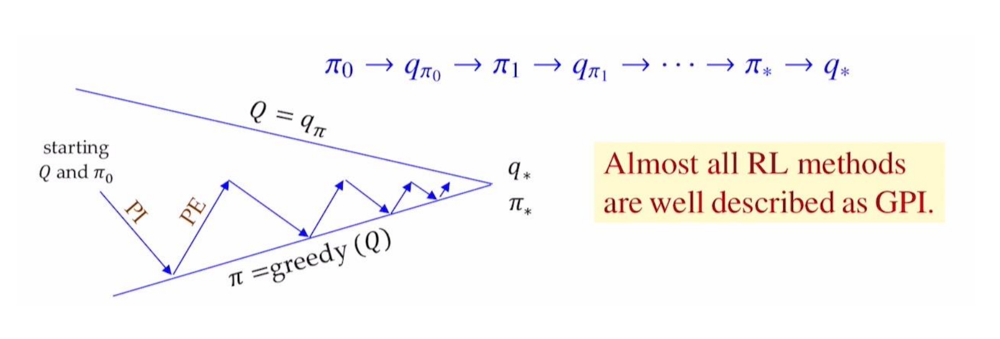

## Dynamic Programming

Method for solving Markov Decision Processes (MDPs)

- DP assumes
	- Model-based
	- The Markov property

<!-- -->

 - DP uses the Bellman equation to iteratively update value functions.

<!-- -->

- Goal
	- Compute the optimal value function
	- Derive the optimal policy

<!-- -->

Two main approach

- **Value-based approach**
	- Directly update value functions
	- Leads to **Value Iteration**

- **Policy-based approach**
	- Evaluate and improve policies
	- Leads to **Policy Iteration**

### Value Iteration

**Bellman Optimality Equation**
$$v_*(s) = \max\limits_a\sum\limits_{s',r}p(s',r|s,a)[r+\gamma v_*(s')]$$

#### Value Iteration Procedure

$$V_{k+1}(s)\leftarrow\max\limits_a\sum\limits_{s',r} p(s',r|s,a)[r+\gamma V_k(s')]$$

**Initialize $\rightarrow$ Update $\rightarrow$ Compute the Optimal Policy**

Disadvantages
1. Policy often converges long before the values converge: values rarely changes
2. Slow: $O(S^2A)$ per iteration and needs many iterations to converge.

Convergence
- $\epsilon: \lvert V_{k+1}(s) - V_{k}(s) \rvert < \epsilon$ for all $s$

#### Value Iteration Pseudo Code

```pseudocode
#| label: algo-value-iteration
#| html-line-number: true
#| pdf-line-number: true

\begin{algorithm}
\caption{Value Iteration for estimating $\pi \approx \pi_*$}
\begin{algorithmic}
\State \textbf{Hyperparameter:} small threshold $\epsilon > 0$ for the convergence check
\State Initialize $V(s)$ arbitrarily for all $s \in \mathcal{S}$, except $V(\text{terminal}) = 0$

\Repeat
	\State $\Delta \gets 0$
	\For{each $s \in \mathcal{S}$}
    	\State $v \gets V(s)$
    	\State $V(s) \gets \max_{a} \sum_{s', r} p(s', r \mid s, a) [r + \gamma V(s')]$
    	\State $\Delta \gets \max(\Delta, |v - V(s)|)$
  	\EndFor
\Until{$\Delta < \epsilon$}

\State \textbf{Output} a deterministic policy $\pi \approx \pi_*$ such that
\State $\pi(s) = \arg\max_{a} \sum_{s', r} p(s', r \mid s, a) [r + \gamma V(s')]$
\end{algorithmic}
\end{algorithm}
```

### Policy Iteration

#### Policy Iteration Procedure
1. **Policy Evaluation**
	- Compute $V^\pi$ from the deterministic policy $\pi$
	- $$V_{k+1}(s)\leftarrow\sum\limits_{s',r} p(s',r|s,\pi(s)) [r+\gamma V_k(s')]$$
	1. Initialize $V_0(s)=0$ for all states $s$.
	2. Update $V_{k+1}(s)$ from all $V_k(s')$ (full backup) $\rightarrow$ until convergence to $V^\pi(s)$
2. **Policy Improvement**
	- Improve policy $\pi$ to $\pi'$ using a greedy policy based on $V^\pi$
	- $$\pi'(s) = \arg\max\limits_a\sum\limits_{s',r} p(s',r|s,a) [r+\gamma V^\pi(s')] = \arg\max\limits_a Q^\pi(s,a)$$

#### Value vs Policy Iteration
- In Value Iteration, $\pi_*$ is computed at the end using $V^*$.
- In Policy Iteration, improvement is done at every step.

**Comparison to Value Iteration**
- Fewer iterations are needed to reach the optimal policy.
- Faster convergence because the value update is based on a fixed policy.

<!-- -->

- Since $Q^\pi(s,\pi'(s))\ge V^\pi(s) = \sum\limits_a\pi(a|s) Q^\pi(s,a)$, always either
	1. $\pi'$ is strictly better than $\pi$, or
	2. $\pi'$ is optimal when $\pi=\pi'$

$\Rightarrow$ Policy Improvement Theorem

#### Policy Improvement

::: {.callout-important title="Policy Improvement Theorem"}
Let $\pi$ and $\pi'$ be two policies.

If $Q^\pi(s,\pi'(s))\ge V^\pi(s)$ for all $s\in S$, $V^{\pi'}(s)\ge V^\pi(s)$ for all $s\in S$.

This implies that $\pi'$ is better policy than $\pi$.
:::

$$
\begin{aligned}
v_\pi(s) &\le q_\pi(s,\pi'(s))\\
&=\mathbb{E}[R_{t+1}+\gamma v_\pi(S_{t+1})|S_t=s,A_t=\pi'(s)]\\
&=\mathbb{E}_{\pi'}[R_{t+1}+\gamma v_\pi(S_{t+1})|S_t=s]\\
&\le\mathbb{E}_{\pi'}[R_{t+1}+\gamma q_\pi(S_{t+1},\pi'(S_{t+1}))|S_t=s]\\
&=\mathbb{E}_{\pi'}[R_{t+1}+\gamma \mathbb{E}_{\pi'}[R_{t+2}+\gamma v_{\pi}(S_{t+2})|S_{t+1}, A_{t+1}=\pi'(S_{t+1})]|S_t=s]\\
&=\mathbb{E}_{\pi'}[R_{t+1}+\gamma R_{t+2}+\gamma^2v_\pi(S_{t+2})|S_t=s]\\
&\ \ \vdots\\
&\le\mathbb{E}_{\pi'}[R_{t+1}+\gamma R_{t+2}+\gamma^2 R_{t+3}+\cdots|S_t=s]\\
&=v_{\pi'}(s)
\end{aligned}
$$

#### Policy Iteration
$$\pi_0 \rightarrow \text{policy evaluation} \rightarrow V^{\pi_0} \rightarrow \text{policy improvement} \rightarrow \pi_1 \rightarrow \cdots \rightarrow \pi_* \rightarrow V^*$$
- A **finite MDP** has finitely many policies, so this process converges to an **optimal policy** and an optimal value function in **finite iterations**.
- If $\pi'$ is as good as, but not better than $\pi$, then $v_\pi=v_{\pi'}$ and satisfies Bellman optimality equation
	- $$v_{\pi'}(s)=\max\limits_a\sum\limits_{s',r}p(s',r|s,a) [r+\gamma v_{\pi'}(s')]$$
	- Thus, $\pi'$ is optimal.

#### Pseudo Code

```pseudocode
#| label: algo-policy-iteration
#| html-line-number: true
#| pdf-line-number: true

\begin{algorithm}
\caption{Policy Iteration for estimating $\pi \approx \pi_*$}
\begin{algorithmic}
\State \textbf{1. Initialization}
\State $V(s) \in \mathbb{R}$ and $\pi(s) \in \mathcal{A}(s)$ arbitrarily for all $s \in \mathcal{S}$

\State
\State \textbf{2. Policy Evaluation}
\Repeat
  \State $\Delta \gets 0$
  \For{each $s \in \mathcal{S}$}
    \State $v \gets V(s)$
    \State $V(s) \gets \sum_{s', r} p(s', r \mid s, \pi(s)) [r + \gamma V(s')]$
    \State $\Delta \gets \max(\Delta, |v - V(s)|)$
  \EndFor
\Until{$\Delta < \epsilon$}

\State
\State \textbf{3. Policy Improvement}
\State $policy-stable \gets \text{true}$
\For{each $s \in \mathcal{S}$}
  \State $old-action \gets \pi(s)$
  \State $\pi(s) \gets \arg\max_{a} \sum_{s', r} p(s', r \mid s, a) [r + \gamma V(s')]$
  \If{$old-action \neq \pi(s)$}
    \State $policy-stable \gets \text{false}$
  \EndIf
\EndFor

\State
\If{$policy-stable$}
  \State \textbf{stop} and return $V \approx v_*$ and $\pi \approx \pi_*$
\Else
  \State \textbf{go to 2}
\EndIf
\end{algorithmic}
\end{algorithm}
```

### Summary

Finding an optimal policy by solving Bellman optimality equation requires

- **Markov property**
- **Accurate knowledge** of environment dynamics (known MDP)
- **Enough space and time** to do the computation

**Dynamic Programming**

- Under **model-based**, each iteration updates **every value function** in the table using **full backup** $\rightarrow$ effective for **medium-sized** problems
- Usually evaluate $V(s)$ instead of $Q(s,a)$ because $|s| \ll |(s,a)|$
- For large problems, DP suffers from the **curse of dimensionality**:
	- The number of states grows exponentially with the number of state variables

## Reinforcement Learning

### Reinforcement Learning

#### DP vs RL
- Dynamic Programming (DP)
	- Planning under **model-based** setting using **full-backup**.
	- Each iteration updates **every value** in the table using **full backup**.
	- Usually, evaluate $V(s)$ rather than $Q(s,a)$.
	- Greedy policy improvement over $V(s)$ **requires known MDP**.

		- $$\pi_*(s) = \arg\max\limits_a\sum_{s',r} p(s',r | s,a) [r + \gamma V^*(s')]$$

<!-- -->

- Reinforcement Learning (RL)
	- Learning under **model-free** setting using **sample backup**, and approximately solving the Bellman optimality equation.                 
        
	-  Monte Carlo (MC) method
	- Temporal Difference (TD) learnings
		- Sarsa
		- Q-learning

	- Each iteration updates some values in the table from **sampl backup**.
	- We evaluate $Q(s,a)$ instead of $V(s)$.
	- Greedy policy improvement over $Q(s,a)$ **works for model-free settings:**

		- $$\pi'(s)=\arg\max\limits_a Q^{\pi}(s,a)$$

#### Generalized Policy Iteration (GPI)
- **Policy Evaluation** makes the vlaue function "consistent with the current policy"
- **Policy Improvement** makes the policy "greedy w.r.t. the current value function"


### Monte Carlo Methods

#### Monte Carlo (MC)
- Repeated random sampling to compute numerical results
- Tabular updating and model-free method.

- MC Policy Iteration adapts GPI based on episode-by-episode of PE estimating $Q(s,a)=q_\pi(s,a)$ and e-greedy PI.
- MC learns from entire trajectory fo sampled episodes, updating after every single episode using real experience.

$$\text{Value} = \text{average of returns } G_t \text{of sampled episodes}$$

- MC focuses on a small subset of the states.
- 이 방법은 'Successor value estimates'에 의존하지 않기 때문에 Markov property 위반으로 인한 피해가 적다.

$$\Rightarrow\text{No bootstrapping}$$

#### MC Prediction (Policy Evaluation)
- Goal: learn $q_\pi$ from enitre episodes of real experience under policy $\pi$.
- MC Policy Evaluation uses **empirical mean return** instead of expected return.

- To estimate $q_\pi(s,a)$
    1. For each time step $t$ when state $s$ is visited and action $a$ is taken:
		- Increment count: $n(s,a) \gets n(s,a) + 1$
		- Increment total return: $S(s,a) \gets S(s,a) + G_t$
		- Estimate mean return: $Q(s,a) = S(s,a) / n(s,a)$
- As $n(s,a) \to \infty$, $Q(s,a) \to q_\pi(s,a)$

#### Incremental MC updates
- Incremental Mean
	- Partial mean $\mu_k$ of sequence $x_1, x_2, \ldots$ is computed incrementally
	$$\mu_k = \frac{1}{k}\sum_{i=1}^k x_i = \mu_{k-1} + \frac{1}{k}(x_k - \mu_{k-1})$$

- Incremental Monte Carlo Updates
	- Increment count: $n(S_t, A_t) \gets n(S_t, A_t) + 1$
	- Update rule: $Q(S_t, A_t) \gets Q(S_t, A_t) + \frac{1}{n(S_t, A_t)} [G_t - Q(S_t, A_t)]$

#### constant $\alpha$ MC Policy Evaluation
- In practice, a **step-size** $\alpha$ is used
$$Q(S_t, A_t) \gets Q(S_t, A_t) + \alpha [G_t - Q(S_t, A_t)]$$

- Old episodes are exponentially forgotten due to the $(1-\alpha)Q(S_t, A_t)$ term.

#### Exploitation vs Exploration
- **Exploitation**: making the best decision by using already known information
	- By selecting the action with the highest Q-value while sampling new episodes, we can refine our policy efficiently from an alreadly promising region in the state-action space.
- **Exploration**: searching for new decisions by gathering more information
	- By selecting an extra random action while $\epsilon$-probability while sampling new episodes, we can find a new and maybe more promising region within the state-action space.

- To trade-off Exploitation and Exploration, use **$\epsilon$-greedy policy**.

#### MC Control ($\epsilon$-Greedy Policy Improvement)
- Choose the greedy action with probability $1-\epsilon$ and a random action with probability $\epsilon$.
$$\epsilon/m \text{ for each of all } m \text{ actions } \Rightarrow \text{stochastic policy}$$

- All actions are selected with non-zero probability for ensuring continual exploration.
$$\pi'(a|s) = \begin{cases}1 - \epsilon + \epsilon/m & \text{if } a=\arg\max_{a'}Q^\pi(s,a') \\ \epsilon/m & \text{otherwise } (m-1 \text{actions})\end{cases}$$

- In full backup DP, Policy Improvement uses
$$\pi'(s) = \arg\max_{a} Q^\pi(s,a) \Rightarrow \text{deterministic policy}$$

- For any $\epsilon$-greedy policy $\pi$, $\epsilon$-greedy policy $\pi'$ with respect to $q_\pi$ is always improved: $v_{\pi'}\ge v_\pi(s)$

#### Greedy in Limit with Infinite Exploration (GLIE)
- All state-action pairs $(s,a)$ are explored infinitely many times:
$$\lim\limits_{k\to\infty}n_k(s,a)=\infty$$

- The learning policy converges to a greedy policy:
$$\lim\limits_{k\to\infty}\pi_k(a|s) = 1 \text{ where } a = \arg\max\limits_{a'}Q_k(s,a')$$

- GLIE MC Control: $\epsilon$-greedy is GLIE if $\epsilon_k\to 0$ as follows:
    - In the $k$-th episode using policy $\pi$, for each state-action pair $(S_t,A_t)$:
	$$n(S_t, A_t) \gets n(S_t, A_t) + 1Q(S_t, A_t) \gets Q(S_t, A_t) + \frac{1}{n(S_t, A_t)} [G_t - Q(S_t, A_t)]$$

	- Improve policy based on the new action-value function:
    $\epsilon=1/k,\pi\gets\epsilon\text{-greedy}(Q)$

- GLIE MC Control converges to the optimal: $Q(s,a)\to q_*(s,a)$

```pseudocode
#| label: algo-monte-carlo-method
#| html-line-number: true
#| pdf-line-number: true

\begin{algorithm}
\caption{Monte Carlo Method}
\begin{algorithmic}
\State \textbf{1. Initialization}
\State $Q(s,a)$, all $S\in\mathcal{S}$, $A\in\mathcal{A}(S)$, arbitrarily and $Q(\text{terminal}, \cdot) = 0$ 
\State Returns $(S,A) \gets$ empty list
\State $\pi \gets$ arbitrarily $\epsilon$-soft policy (non-empty probabilities)

\State
\State \textbf{2. Repeat for each episode}
\Repeat
	\State (a) Generate an episode using $\pi:S_0, A_0, R_1, S_1, \ldots, S_{T-1}, A_{T-1}, R_T$
	\State $G\gets 0$
	\State (b)
	\For{each step of episode, $t=T-1, T-2, \ldots, 0$}
		\State $G \gets \gamma G + R_{t+1}$
		\State Unless $(S_t, A_t)$ appears in $(S_0, A_0), \ldots, (S_{t-1}, A_{t-1})$: ignore this lien for every-visit MC
		\State Append $G$ to Returns $(S_t, A_t)$
		\State $Q(S_t, A_T)\gets$ average(Returns$(S_t, A_t)$)
	\EndFor
	\For{each $S_t$ in the episode}
		\State $A^*\gets\arg\max_{a}Q(S_t,a)$
		\For{all $a\in\mathcal{A}(S_t)$}
			\State $\pi(a|S_t) \gets \begin{cases}1-\epsilon + \epsilon/|\mathcal{A}(S_t)| & \text{if } a=A^* \\ \epsilon/|\mathcal{A}(S_t)| & \text{otherwise}\end{cases}$
		\EndFor
	\EndFor
\Until{$\text{forever}$}
\end{algorithmic}
\end{algorithm}
```